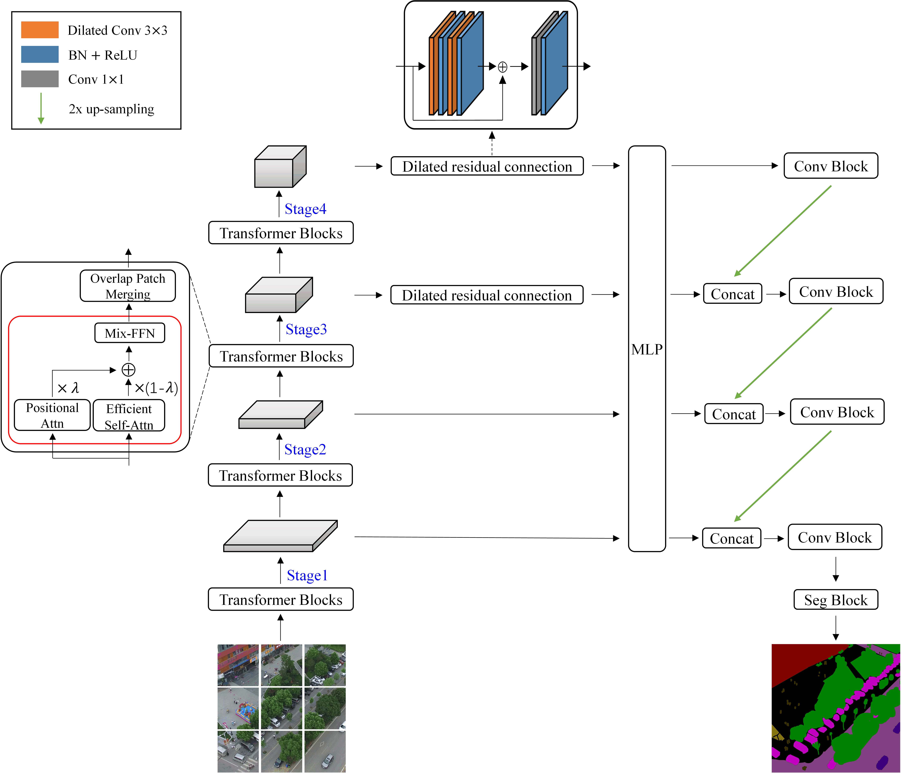

# 2DSegFormer: 2-D Transformer Model for Semantic Segmentation on Aerial Images

<!--  -->
<div align="center">
  
</div>
<p align="center">
  Figure 1:  Overall architecture of 2DSegFormer.
</p>

### [Project page](https://github.com/Lixinyu98/2DSegFormer) | [Paper](https://ieeexplore.ieee.org/document/9955997)

2DSegFormer: 2-D Transformer Model for Semantic Segmentation on Aerial Images.<br>
Xinyu Li, Yu Cheng, Yi Fang, Hongmei Liang and Shaoqiu Xu.<br>
IEEE Transactions on Geoscience and Remote Sensing.

This repository contains the official Pytorch implementation of training & evaluation code.

2DSegFormer is an efficient 2-D semantic transformer model for semantic segmentation on aerial images, as shown in Figure 1.

We use [MMSegmentation v0.13.0](https://github.com/open-mmlab/mmsegmentation/tree/v0.13.0) as the codebase.

## Installation

For install and data preparation, please refer to the guidelines in [MMSegmentation v0.13.0](https://github.com/open-mmlab/mmsegmentation/tree/v0.13.0) and [SegFormer](https://github.com/NVlabs/SegFormer).

## Training & Evaluation

Download the pretrained weights of Mix Transformers (MiTs) on ImageNet-1K in [SegFormer](https://github.com/NVlabs/SegFormer), and put them in a folder ```pretrained/```.

Training and evaluation according to the coding style of [MMSegmentation v0.13.0](https://github.com/open-mmlab/mmsegmentation/tree/v0.13.0).

## License
License under an MIT license.


## Citation
If you find the code or trained models useful, please consider citing:
```
@ARTICLE{9955997,
  author={Li, Xinyu and Cheng, Yu and Fang, Yi and Liang, Hongmei and Xu, Shaoqiu},
  journal={IEEE Transactions on Geoscience and Remote Sensing}, 
  title={2DSegFormer: 2-D Transformer Model for Semantic Segmentation on Aerial Images}, 
  year={2022},
  volume={60},
  number={},
  pages={1-13},
  doi={10.1109/TGRS.2022.3223416}}
```
